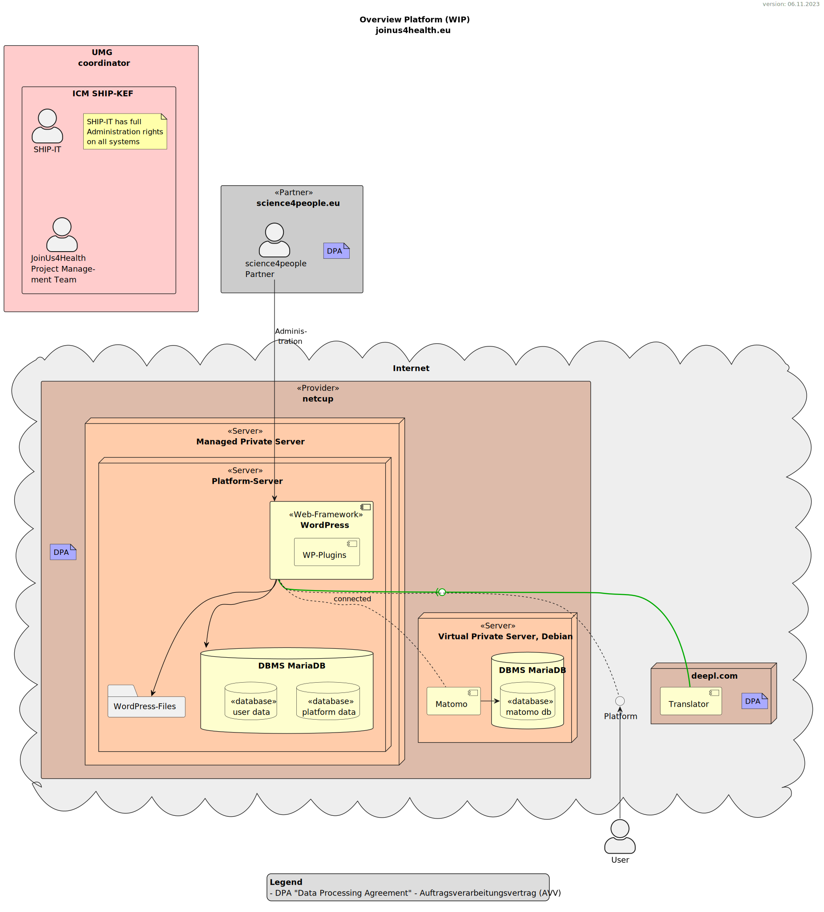

# Information Security Overview

<!-- TOC START min:2 max:5 link:true asterisk:false update:true -->
- [Project Overview](#project-overview)
    - [Coordinator UMG](#coordinator-umg)
    - [Short Project Description](#short-project-description)
    - [Technical Infrastructure Overview](#technical-infrastructure-overview)
        - [Partner science4people](#partner-science4people)
        - [Provider netcup - Platform](#provider-netcup---platform)
        - [Provider ??? - Conference-System](#provider----conference-system)
    - [Software](#software)
        - [WordPress - Base Platform](#wordpress---base-platform)
        - [LimeSurvey - Questionnaire-System](#limesurvey---questionnaire-system)
        - [BigBlueButton - Conference-System](#bigbluebutton---conference-system)
- [Data processed in the Components of the JoinUs4Healt-Platform](#data-processed-in-the-components-of-the-joinus4healt-platform)
    - [The Users Profile](#the-users-profile)
- [User Authentication](#user-authentication)
- [Security](#security)
<!-- TOC END -->

## Project Overview
### Coordinator UMG
- Project Coordinator: Dr. Birgit Schauer
- Project Management: Dr. Sabine Schipf, Antje Witt

### Short Project Description

### Technical Infrastructure Overview
The following UML-Diagram shows the overall technical infrastructure as well as the user view, the administrators and the data processing agreements.  
The main system ist based on WordPress. It provides the platform with all content and functions. The central user authentication is done with the WordPress-internal user-management. The data for the WordPress system is separated in two databases, one for personal data and user accounts, the second one for the content.

#### Partner science4people
Our project-partner Science4People (Warszawska Nr 6 Lok 23; Bialystock 15 063, Poland) is responsible for the technical administration of the sub-systems such as WordPress, LDAP, the Questionnaire-System.
Science4people signed an appropriate data processing agreement/Auftragsverarbeitungsvertrag (DPA/AVV) with the UMG and we provide further guidelines and restrictions regarding security. Please see the document `requirements_administration` for more information.

#### Provider netcup - Platform
The provider https://netcup.de (netcup GmbH; Daimlerstraße 25; D-76185 Karlsruhe) provides the main server environment as "Managed Private Server" running:
- the main WordPress-Instance with the platform
- the LDAP-Server *TODO; Status: planning; to be implemented; details following*
- the Questionnaire-System *TODO; Status: planning; to be implemented; details following*

Also the WordPress-Website https://joinus4health.eu runs on a netcup server but is strictly separated from the platform. Please see the data processing agreement/Auftragsverarbeitungsvertrag (DPA/AVV) with netcup for details about the contract and netcups TOMs.

#### Provider ??? - Conference-System
*TODO; Status: planning; to be implemented; details following*

### Software
#### WordPress - Base Platform
- hosted at netcup on a dedicated server
- purpose: provide the base platform with content, user authentication and team structures

Netcup provides a special WordPress-environment with configuration options on certain security aspects and automatic updates of the base software, plugins and themes.  
For details on the WordPress-configuration and all Plugins used, please see the documentation `Server_WordPress_documentation`.

#### LimeSurvey - Questionnaire-System
- hosted at netcup on a dedicated server
- purpose: Users of the platform are allowed to create small anonymous surveys within their topics
- *TODO; Status: planning; to be implemented; details following*

#### BigBlueButton - Conference-System
- hosted at ???
- purpose: to enhance team communication, we provide a conference system for virtual meetings
- *TODO; Status: planning; to be implemented; details following*

## Data processed in the Components of the JoinUs4Healt-Platform

### The Users Profile
The minimum personal data for new users needed to create an account is an e-mail-address.
However, the user is requested to give some more information according to the following table.
Also other fields then the e-mail-address can contain personal data.

| Information                                                        | Required | publicly visible |
| ------------------------------------------------------------------ | -------- | ---------------- |
| user name (real or fictional)                                      | yes      | yes              |
| password                                                           | yes      | no               |
| year of birth (other users only see age group)                     | optional | optional         |
| gender (male, female, gender-neutral)                              | optional | optional         |
| language(s) (DE, EN, PL, NL)                                       | yes      | optional         |
| e-mail address                                                     | yes      | no               |
| country                                                            | yes      | yes              |
| consent with terms of conditions and data privacy agreement        | yes      | no               |
| post code of residence                                             | optional | no               |
| which RRI group(s)                                                 | optional | optional         |
| whether the user is a participant in one of the cohorts            | optional | optional         |
| whether the scientist / staff member works at a cohort institution | optional | optional         |
| experience                                                         | optional | optional         |
| specific interests                                                 | optional | optional         |
| additional languages                                               | optional | optional         |
| how they became aware of the platform                              | optional | no               |

## User Authentication
The authentication of the user is done by WordPress (the base of the platform) internally. Other systems as the Conference-Platform and the Questionnaire-System are connected via their APIs with WordPress as the primary system.

## Security
- all connections are TLS encrypted (at least v1.3, only high ciphers)
- database separation for personal data (user profiles) and platform data (other content)
- automatic updates for all used systems
- operational requirements for all administrators, please see `requirements_administration`

