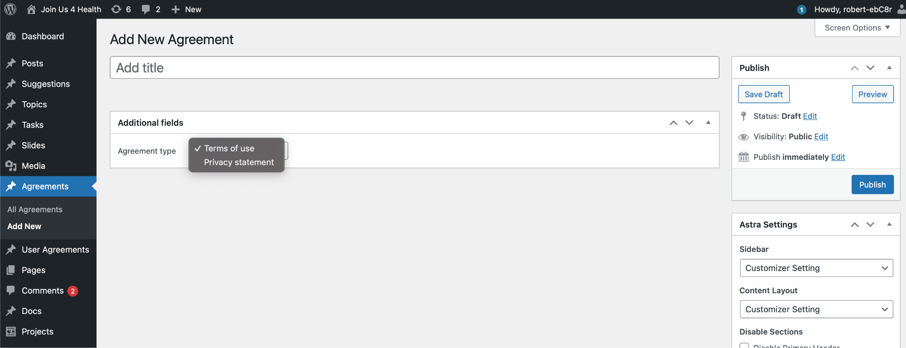
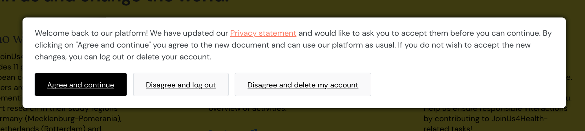

# Overview
This document gives a step-by-step-guide to change any *legal document* on the JoinUs4Health-Platform.

*Legal documents* are:

    - Privacy Statement
    - Terms Of Use

All versions of all *legal document* can be found in this repository in the *pages*-folder.

# Prepare Legal Document

1. Work on changes in the legal document.
    - To update a *legal document*, the new version must be updated in this repository fist. This happens in a *branch* usually.
1. Merge to the *main*.
    - As soon as the document editing is finished, a new version will be set and the *branch* is merged to the *main*.
1. *Tag* the new version.
    - Then the new version in the *main* is *tagged* with the version number (document + date timestamp), i.e. `terms_of_use_platform_20220408` or `privacy_statement_platform_20220412`
    - The *timestamp* must match the version stated in the document!
1. Convert to HTML for use on the platform.
    - To create the HTML-Version of the *legal documents*, a script `create_html.sh` is prepared in the *pages*-folder.

# Add the Legal Document to the Platform and get Consent from the Users

1. Change the text of the document on the page
    1. Privacy Policy:
        - EN: `https://platform.joinus4health.eu/privacy-policy/privacy-policy/`
        - DE: `https://platform.joinus4health.eu/privacy-policy/datenschutzerklarung/`
    1. Terms of use
        - EN: `https://platform.joinus4health.eu/terms-of-use/terms-of-use/`
        - DE: `https://platform.joinus4health.eu/terms-of-use/nutzungsbedingungen/`
1. In the "Agreements" tab - create a new version
    1. Give it a name
    1. select which document was updated - one version can update one type of document  
        
1. Publish new "Agreements"
1. Each user will be informed when a new document needs to be approved  
    

